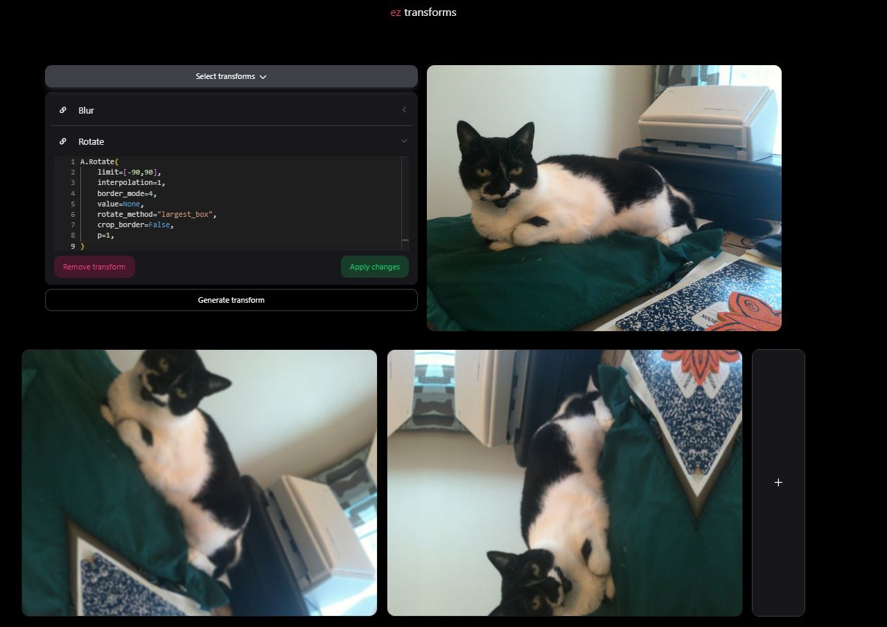

# ez-transforms

## Tech Stack

- React (TypeScript)
- Tailwind, NextUI, Monaco Text Editor, Axios
- Flask (Backend API)

## About

Improving the official <a href="https://huggingface.co/spaces/qubvel-hf/albumentations-demo" target="_blank">albumentations-demo</a>

- Upload your image and select your transform(s) from the albumentations library
- Discover the relationships between transforms and finetune your data augmentation pipeline
- Edit transform properties to experiment with hyperparameter tuning
- Generate different variations of the transforms side-by-side for comparison and download your results

<div align="center">
    
</div>

## Usage

The backend service is hosted on AWS. I don't plan on maintaining a domain name so the frontend hosted on Vercel won't be able to serve HTTP requests to generate the transformed image. To run the application locally:

1. Clone this repository
   `git clone https://github.com/teddyld/ez-transforms.git`

2. Run the frontend locally
   ```
   cd frontend
   npm install
   npm run dev
   ```
3. Optionally run the backend locally
   ```
   cd backend
   pip install requirements.txt
   python3 app.py
   ```

## Support

The version of albumentations used is 1.4.6.
